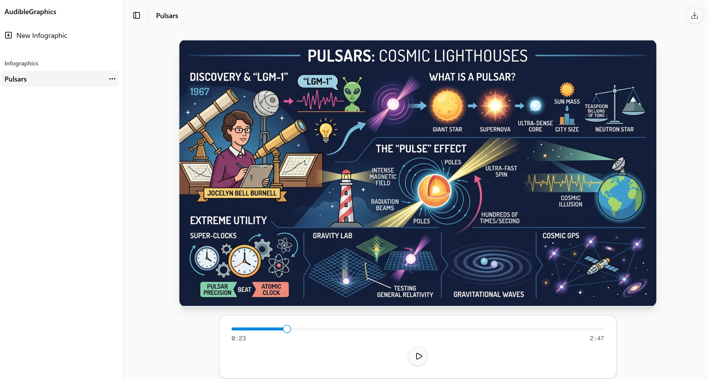

# AudibleGraphics

Generate narrated infographics locally using Google Gemini for images, scripts, and text-to-speech. Enter any topic and get a full-screen infographic with an AI-generated narration script and audio.



## Features

- **AI-generated infographics** - Gemini generates the image, script, and narration from a single topic or question
- **Text-to-speech narration** - Gemini voices bring the infographic to life
- **Multiple aspect ratios** - 16:9 (landscape) and 9:16 (portrait)
- **4 voice options** - Achird, Aoede, Charon, Laomedeia
- **MP4 export** - Download your infographic as a shareable video
- **Local storage** - Everything is saved locally, no cloud accounts needed

## Prerequisites

- **Node.js 20.9+** (required by Next.js 16)
- **npm** (bundled with Node.js)
- **Windows, macOS, or Linux**. FFmpeg is bundled through npm dependencies; no separate system FFmpeg install is required.

## Setup

1. **Clone the repository**
   ```bash
   git clone https://github.com/Cp557/audiblegraphics.git
   cd audiblegraphics
   ```

2. **Install dependencies**
   ```bash
   npm install
   ```

3. **Add your API key**

   Open `.env` and fill in your key. The Google account or project behind this key must have billing enabled for Gemini API usage.
   ```
   GEMINI_API_KEY=your-gemini-api-key-here
   ```

4. **Generate voice samples**
   ```bash
   npm run generate:voice-samples
   ```

5. **Start the app**
   ```bash
   npm run dev
   ```
   Open [http://localhost:3000](http://localhost:3000)

## Getting API Keys

- **Gemini** - [aistudio.google.com](https://aistudio.google.com) -> Get API key. Make sure billing is enabled for the API key's Google Cloud project before generating infographics or voice samples.

## How It Works

1. Enter a topic or question in the input box
2. Choose a voice and aspect ratio
3. Click **Generate** - Gemini creates the script, image, and narration audio
4. Your infographic is saved locally and listed in the sidebar
5. Optionally download as MP4 video

## Local Storage

Each infographic is stored as its own folder under `public/uploads/`, named after the topic:

```
public/uploads/
  history-of-rome/
    image.jpg
    audio.mp3
    meta.json    <- title, speaker notes, aspect ratio, creation date
    video.mp4    <- only present if you exported it
  black-holes-explained/
    image.jpg
    audio.mp3
    meta.json
```

Everything is gitignored - your generated content stays local.

## Tech Stack

- **Next.js 16** (App Router)
- **TypeScript**
- **Tailwind CSS v4**
- **shadcn/ui**
- **Google Gemini** (`@google/genai`) - image, script, and text-to-speech generation
- **ffmpeg-static + Sharp** - MP4 video export (bundled, no system install needed)
